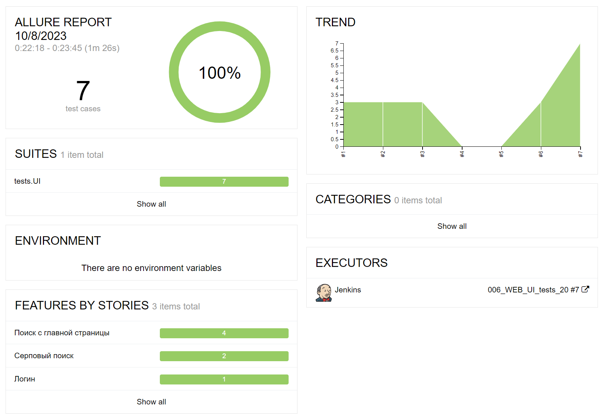
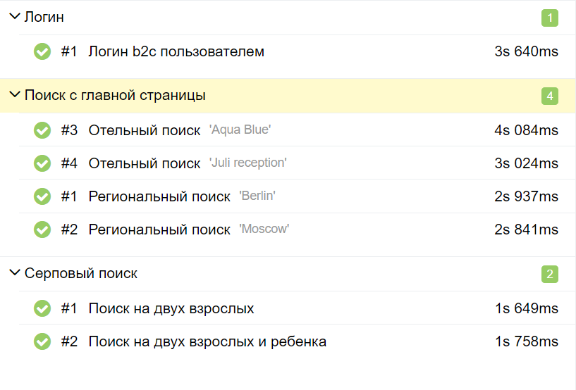

## Пример организации кода UI-автотестов для тестирования сайта бронирований Zenhotels.com

## Реализованные сценарии:

* Проверка авторизации пользователя
* Проверка регионального поиска
* Проверка отельного поиска
* Проверка поиска для взрослых/детей

## Применяемые технологии

<table>
    <tr>
        <td></td>
        <td>Pycharm</td>
    </tr>
    <tr>
        <td></td>
        <td>Python</td>
    </tr>
    <tr>
        <td></td>
        <td>Pytest</td>
    </tr>
    <tr>
        <td></td>
        <td>Selene</td>
    </tr>
    <tr>
        <td></td>
        <td>Selenoid</td>
    </tr>
    <tr>
        <td></td>
        <td>Jenkins</td>
    </tr>
    <tr>
        <td></td>
        <td>Allure</td>
    </tr>
</table>

## Запуск

1. Зарегистрировать пользователя на сайте Zenhotels.com
2. Заполнить значения переменных SITE_USERNAME, SITE_PASSWORD, SELENOID_USERNAME, SELENOID_PASSWORD в файле .env.example.
3. Файл .env.example переименовать в .env
4. Создать локальное окружение и активировать его:
```bash
python -m venv .venv
source .venv/bin/activate
```
5. Установить зависимости:
```bash
pip install -r requirements.txt
```
6. Запустить тесты:
```bash
pytest .
```

## Скриншоты Allure-отчета


